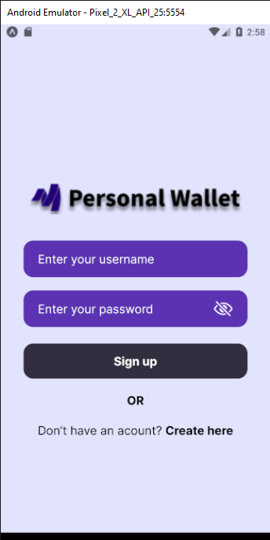
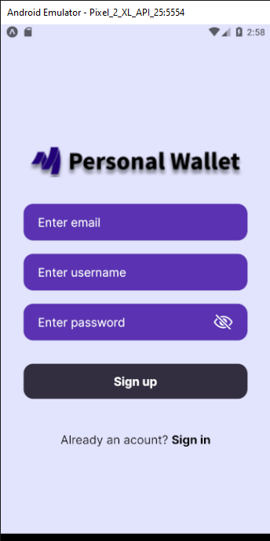
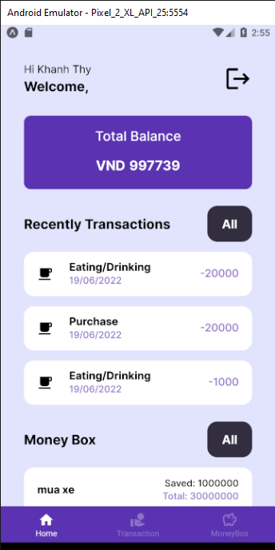
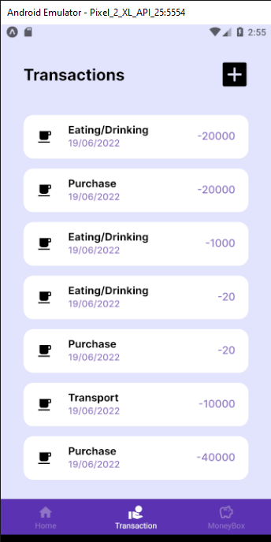

# PERSONAL WALLET APP

A mobile app to control your finances

## Features

- Balance Tracking
- Transaction tracking (income / expense)
- Saving Money (Money Box)

## Technology used

- React Native for Mobile
- Caching data using [AsyncStorage](https://docs.expo.dev/versions/latest/sdk/async-storage/)
- Authentication and Authorization using JWT.
- Backend using Django

## Directory structure

```
project
│   README.md
│
│
└───src
│   |
│   └───commponents
│   |   |
│   │   └───atoms
│   |   |
│   │   └───molecules
│   |   |
│   │   └───organisms
│   |   |
│   │   └───template
│   │
│   └───navigation
│   │
│   └───redux
│   |   |
│   |   └───slices
│   |   |
│   |   └───store.js
|   |
│   │
│   └───sceens
│   |   |
│   |   └───slices
│   |   |
│   |   └───store.js
│   │
│   └───services
│   │
│   └───shared
|
└───assets
|       └───icons
|       |
|       └───images
|       |
|       └───logos
|       |
|       └───fonts
|
└───.env <-[.env for environment]
```

## Setup and run

<details>
    <summary>Click to expand</summary>
    <br>

- Setup and run
  - Yarn/npm
  - Expo
    - Install [Expo](https://docs.expo.dev/get-started/installation/).
  - Install npm dependencies:
    ```
    yarn install
    or npm install
    ```
  - Run project:
    ```
    "start": "expo start",
    "android": "expo start --android",
    "ios": "expo start --ios",
    "web": "expo start --web",
    "eject": "expo eject"
    ```
    </details>

## Screenshots

<details>
    <summary>View Screenshots</summary>
    <br>
1. Login Screen



2. Sign Up Screen



3. Home Screen



4. Transaction Screen



5. Money Box


</details>

## Todo

## Contributors ✨

<!-- ALL-CONTRIBUTORS-LIST:START - Do not remove or modify this section -->
<!-- prettier-ignore-start -->
<!-- markdownlint-disable -->
<table>
  <tr>
    <td align="center"><br /><sub><b>Lê Ngọc Khánh Thy</b></sub></a><br /><a href="https://github.com/thylnk" title="Code">💻</a> <a href="https://github.com/thylnk" title="Documentation">📖</a>
  </tr>
  <tr>
    <td align="center"><br /><sub><b>Lê Thị Kim Chi</b></sub></a><br /><a href="https://github.com/kimchilee11" title="Code">💻</a> <a href="https://github.com/kimchilee11" title="Documentation">📖</a>
  </tr>
</table>

<!-- markdownlint-restore -->
<!-- prettier-ignore-end -->

<!-- ALL-CONTRIBUTORS-LIST:END -->
